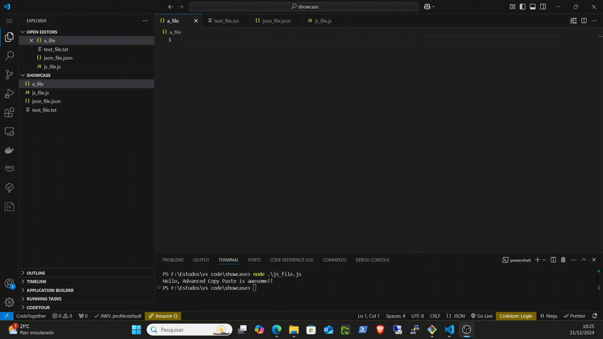

# Advanced Copy Paste

**Advanced Copy Paste** is a Visual Studio Code extension that allows you to manage multiple copied texts efficiently. Organize your clipboard with ease, filter items, save them, and paste them whenever needed.

---

## Features

- **Clipboard List Management**: Store multiple copied items in an organized list.
- **Quick Paste**: Paste individual items or all items from the list.
- **Search**: Filter items in the clipboard using a search bar.
- **Save to File**: Export your clipboard list to a file for future use.
- **Customizable Settings**:
  - Define line endings for pasted text.
- **Lightweight**: Integrates seamlessly with Visual Studio Code.

---

## How to Use

1. **Install the Extension**:
   - Open the Extensions view (`Ctrl+Shift+X`).
   - Search for `Advanced Copy Paste`.
   - Click `Install`.

2. **Access the Clipboard List**:
   - Click on the "Advanced Copy Paste" icon in the Activity Bar.

3. **Copy Items**:
   - Use the command `Copy Selection` (`Ctrl+Shift+C` by default) to add selected text to the clipboard list.

4. **Paste Items**:
   - Click on an item in the clipboard list to paste it at the current cursor position.

5. **Save the Clipboard**:
   - Use the `Save to File` option to export the clipboard as a text file.

6. **Configure Settings**:
   - Open the settings menu (`Ctrl+,`) and search for `Advanced Copy Paste` to customize behavior.

---

## Commands

| Command                        | Description                     | Default Keybinding |
|--------------------------------|---------------------------------|--------------------|
| `acp-view.copySelection`       | Copy selected text to the list | `Ctrl+Shift+C`     |
| `acp-view.pasteItem`           | Paste a specific item           | None               |
| `acp-view.pasteAll`            | Paste all items                 | None               |
| `acp-view.clearAll`            | Clear all items from the list   | None               |
| `acp-view.saveToFile`          | Save clipboard list to a file   | None               |
| `acp-view.search`              | Search through the clipboard    | None               |

---

## Settings

Customize the extension to suit your workflow:

| Setting                       | Description                                     | Default Value |
|-------------------------------|-------------------------------------------------|---------------|
| `advancedCopyPaste.LineEnding`| Line ending to use when pasting text (`\n`, `\r\n`, etc.) | `\n`|

---

## Issues and Feedback

Found a bug or have a feature request? Please report it on the [GitHub Issues page](https://github.com/leochabu/vs-advanced-copy-paste/issues).

---

## Contribution

We welcome contributions! Feel free to submit a pull request or open an issue to discuss ideas.

---

## License

This extension is licensed under the [MIT License](https://opensource.org/licenses/MIT).